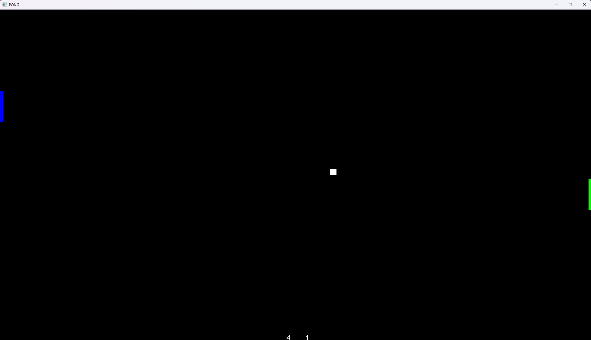
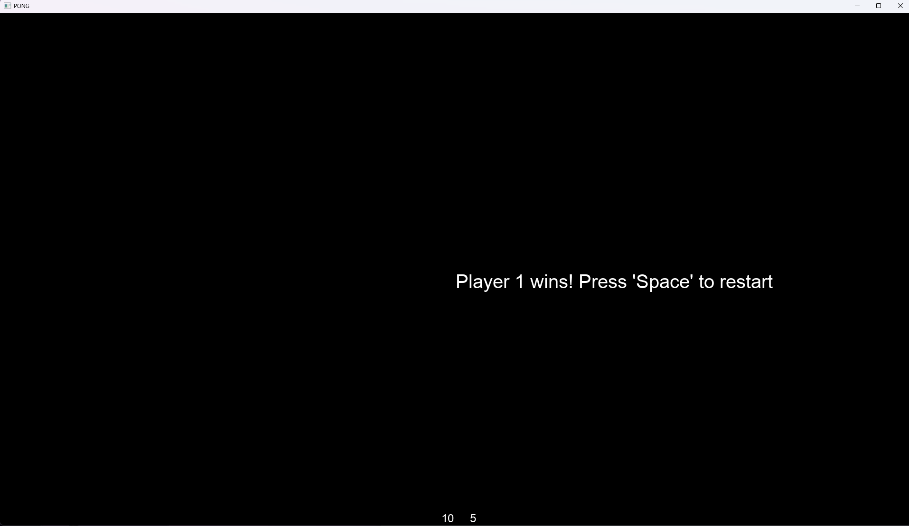

# PONG

This repository features the classical game "Pong". It is a "tennis like" game which features two paddles and a ball.

## The Game

- The goal: winning by being the first one to gain a score of 10
- How to score: the ball flies to the side of the opponent without his paddle defending the ball
- More info about Pong: https://www.ponggame.org/

## Controls

| Left Player (Blue)    | Right Player (Green)  |
| --------------------- | --------------------- |
| `w`: move paddle up   | `↑`: move paddle up   |
| `s`: move paddle down | `↓`: move paddle down |

## Look of the game (current)

## License

The source code is my own work but based on the SFML Template from https://github.com/SFML/cmake-sfml-project.git.
To view the license from the linked repository, see:[LICENSE.md](LICENSE.md).
